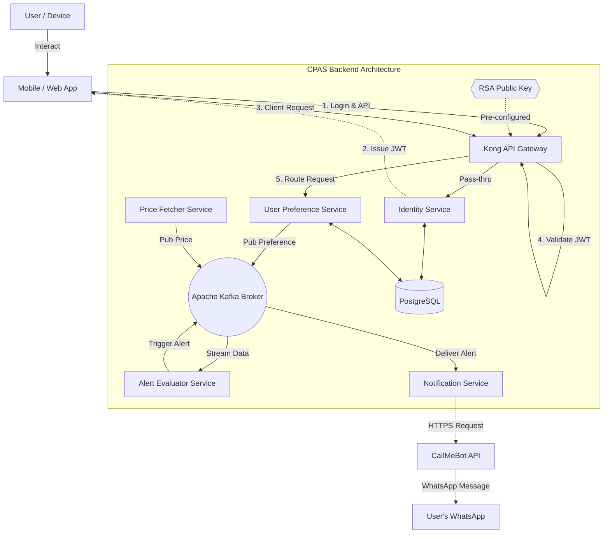
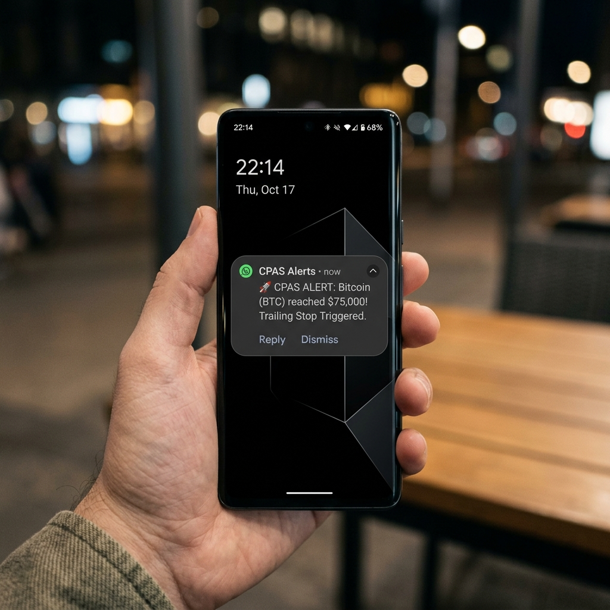

# 📈 Crypto Price Alert System (CPAS) - Backend

A robust, microservices-based backend system designed to provide real-time cryptocurrency price alerts. The system monitors market prices and asynchronously notifies users when their predefined custom conditions are met.

---

## 🛠 Tech Stack

| Layer | Technologies |
| :--- | :--- |
| **Core & Frameworks** |    |
| **Infrastructure** |    |
| **Gateway & Auth** |   |

---

## 🏗 Architecture Overview

The system is built on a distributed microservices architecture, leveraging event-driven communication to ensure high scalability, decoupling, and resilience.



### 🧩 Microservices Ecosystem

- 🔐 **Identity Service**: Handles user registration, authentication, and authorization. Issues RSA-signed JWTs.
- ⚙️ **User Preference Service**: Manages user-defined price alerts and portfolio preferences.
- 📈 **Price Fetcher Service**: Dynamically fetches real-time cryptocurrency prices from external providers (e.g., Binance, CoinGecko).
- 🧠 **Alert Evaluator Service**: The core engine. Subscribes to both price streams and user preferences, evaluating conditions to trigger alerts.
- 🔔 **Notification Service**: Consumes triggered alert events and delivers them via **WhatsApp** (CallMeBot) and other channels.

---

## 📲 Notification Channels

### 🟢 WhatsApp Notifications (via CallMeBot)
The system supports real-time alerts directly to your WhatsApp using the **CallMeBot API**. This ensures you never miss a critical price movement, even when you're on the go.

<p align="center">
  
</p>

> **💡 Why WhatsApp?** Unlike standard push notifications that can be buried, WhatsApp messages provide a persistent, easy-to-read history of your alerts without requiring a dedicated mobile app for receiving.

#### ⚙️ How to Setup
To enable WhatsApp notifications, follow these steps:
1. Add **+34 644 10 55 33** (the CallMeBot bot) to your contacts.
2. Send the message: `I allow callmebot to send me messages`.
3. You will receive an **API Key**.
4. Update the `notification-service` configuration in `application.yaml` or set the following environment variables:
   - `WHATSAPP_PHONE`: Your phone number (with international prefix).
   - `WHATSAPP_APIKEY`: The key you received from the bot.

---

## 🚀 Getting Started

### Prerequisites

- Docker & Docker Compose
- Java 21 (for local development/debugging)
- Maven (for building services)
- OpenSSL (for key generation)

### Security Setup (RSA Keys)

The system relies on Asymmetric RSA Keys to sign and validate JWT tokens across microservices. **Before running the project**, you must generate a key pair:

1. Create a `keys` directory in the project root:
   ```bash
   mkdir keys && cd keys
   ```

2. Generate the Private Key (used by the Identity Service):
   ```bash
   openssl genrsa -out private.pem 2048
   ```

3. Generate the Public Key (used by Kong and Resource Servers to validate tokens):
   ```bash
   openssl rsa -in private.pem -pubout -out public.pem
   ```

> ⚠️ **Note:** The `keys/` directory is ignored in `.gitignore`. Never commit these keys to version control.

### Running Locally

1. **Clone the repository**:
   ```bash
   git clone https://github.com/LeoAoun/Crypto-Price-Alert-System-Backend.git
   cd Crypto-Price-Alert-System-Backend
   ```

2. **Start the Infrastructure (DB, Kafka, Gateway)**:
   ```bash
   docker-compose up -d
   ```
   *Wait a few moments for Kafka and PostgreSQL to be fully ready.*

3. **Build & Run the Microservices**:
   You can build all services using Maven:
   ```bash
   mvn clean install
   ```
   To launch the entire environment locally, you can use the provided script:
   ```bash
   ./start_all.bat  # On Windows
   ```